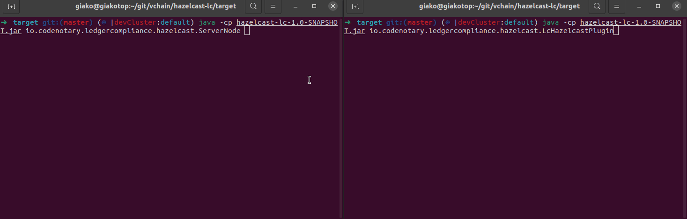

# Hazelcast - Ledger Compliance sample integration



This sample integration is using [Ledger Compliance SDK for Java](https://github.com/vchain-us/ledger-compliance-java).

## Usage

After building the JAR file, cd into `target` directory and run one or more server nodes:

```
java -cp hazelcast-lc-1.0-SNAPSHOT.jar io.codenotary.ledgercompliance.hazelcast.ServerNode
```

In another terminal window, from the same folder, run the [Hazelcast] - [Ledger Compliance] (LC) client:

[Hazelcast]: https://hazelcast.org
[Ledger Compliance]: https://codenotary.io

```
java -cp hazelcast-lc-1.0-SNAPSHOT.jar io.codenotary.ledgercompliance.hazelcast.LcHazelcastPlugin
```

On the server terminal window, put any string and press Enter (type 'q' to exit).
Everytime a non-empty string is entered, a key insertion is performed in Hazelcast.

On the client terminal window, LC Hazelcast client should insert the key-value pair in a Ledger Compliance ledger.
The client is reacting to all insertion events (replica/mirroring scenario). 

The output displayed shows what is written, read and verified on Ledger Compliance. 

## How to build

Using `mvn`:

```
mvn package
```

