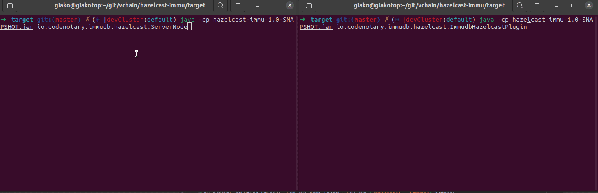

# Hazelcast - immudb sample integration



This sample uses the [official immudb Java client].

[Official immudb Java client]: https://github.com/codenotary/immudb4j

`immudb` must be already running. Follow instructions to download and run it at https://immudb.io/docs/quickstart.html

## Usage

After building the JAR file, cd into `target` directory and run one or more server nodes:

```
java -cp hazelcast-immu-1.0-SNAPSHOT.jar io.codenotary.immudb.hazelcast.ServerNode
```

In another terminal window, from the same folder, run the [Hazelcast] - [immudb] client:

[Hazelcast]: https://hazelcast.org
[immudb]: https://immudb.io

```
java -cp hazelcast-immu-1.0-SNAPSHOT.jar io.codenotary.immudb.hazelcast.ImmudbHazelcastPlugin
```

On the server terminal window, put any string and press Enter (type 'q' to exit).
Everytime a non-empty string is entered, a key insertion is performed in Hazelcast.

On the client terminal window, immudb Hazelcast client should insert the key-value pair in an immudb database.
The client is reacting to all insertion events (replica/mirroring scenario). 

The output displayed shows what is written, read and verified on immudb. 

## How to build

Using `mvn`:

```
mvn package
```

